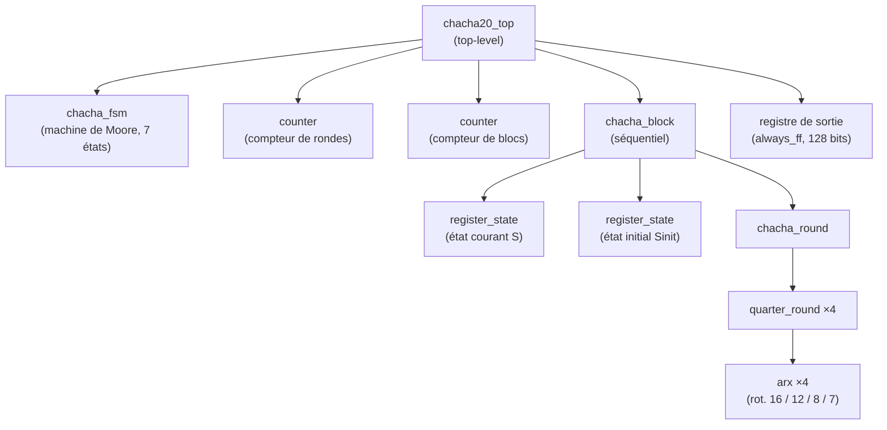

# ChaCha20 — Modélisation SystemVerilog

Implémentation matérielle de l'algorithme de chiffrement par flux **ChaCha20** en SystemVerilog, de la brique combinatoire élémentaire (ARX) jusqu'au module top-level intégrant la machine d'états finis, les compteurs et le registre de sortie.


---

## Sommaire

- [À propos](#à-propos)
- [Architecture](#architecture)
- [Structure du projet](#structure-du-projet)
- [Description des modules](#description-des-modules)
- [Compilation et simulation](#compilation-et-simulation)
- [Validation et vecteurs de test](#validation-et-vecteurs-de-test)
- [Résultats](#résultats)

---

## À propos

ChaCha20 (RFC 8439, D. J. Bernstein) est un algorithme de chiffrement symétrique par flux. Il génère un **keystream** pseudo-aléatoire à partir d'une clé secrète, puis produit le texte chiffré par simple XOR bit à bit avec le message en clair. L'opération XOR étant involutive, le déchiffrement utilise exactement le même procédé.

Principes retenus dans cette implémentation :

- État interne de **512 bits** organisé en matrice **4×4** de mots de 32 bits.
- État initialisé à partir d'une constante fixe (128 bits), de la **clé K** (256 bits), d'un **compteur de bloc** (32 bits, fixé à 1) et d'un **nonce N** (96 bits).
- **20 rondes** de transformation alternant *ronde en colonne* et *ronde en diagonale*, chacune composée de quatre `QuarterRound`.
- Chaque `QuarterRound` enchaîne quatre primitives **ARX** (Addition mod 2³², Rotation, XOR) avec des rotations de 16, 12, 8 et 7 bits.
- Keystream final obtenu par addition mot à mot de l'état final et de l'état initial, modulo 2³².

Le message de test fait **46 octets**, découpé en trois blocs de 16, 16 et 14 octets (le dernier complété par 2 octets de padding).

La conception suit une **approche ascendante** : chaque module est décrit et validé isolément avec son propre testbench, avant intégration à l'étage supérieur, sous **ModelSim**.

---

## Architecture



Le module `chacha20_top` n'introduit aucune nouvelle logique de calcul : il se limite à l'instanciation et au câblage des sous-modules, plus le registre de sortie du texte chiffré. La FSM pilote les deux compteurs et le bloc de calcul ; un multiplexeur sélectionne la tranche de 128 bits du keystream, XORée avec le texte clair puis registrée.

---

## Structure du projet

```
chacha20/
├── src/
│   ├── rtl/
│   │   ├── arx.sv               # Primitive Addition / Rotation / XOR
│   │   ├── quarter_round.sv     # Enchaînement de 4 ARX
│   │   ├── chacha_round.sv      # Rondes colonne / diagonale
│   │   ├── chacha_block.sv      # Cœur séquentiel (état + keystream)
│   │   ├── chacha_fsm.sv        # Machine d'états de Moore
│   │   ├── chacha20_top.sv      # Module top-level
│   │   ├── chacha_pack.sv       # Package (types, ex. state_t)
│   │   ├── register_state.sv    # Registre synchrone à enable (512 bits)
│   │   └── counter.sv           # Compteur paramétrable ena/init
│   └── bench/
│       ├── arx_tb.sv
│       ├── quarter_round_tb.sv
│       ├── chacha_round_tb.sv
│       ├── chacha_block_tb.sv
│       └── chacha20_top_tb.sv
├── compile_chacha20.sh          # Script de compilation ModelSim
└── init_modelsim.txt
```

Convention de nommage : suffixe `_i` pour les entrées, `_o` pour les sorties, `_s` pour les signaux internes.

---

## Description des modules

### Modules RTL

| Module | Type | Rôle |
|---|---|---|
| `arx` | Combinatoire | Addition mod 2³², XOR, puis rotation gauche de `n` bits. Paramètre générique `SHIFT_g` (16/12/8/7). |
| `quarter_round` | Combinatoire (structurel) | Chaîne 4 instances d'`arx`. Transforme les 4 mots `a, b, c, d`. |
| `chacha_round` | Combinatoire | 4 `quarter_round` en parallèle. `sel_i` choisit colonne (0) ou diagonale (1). |
| `chacha_block` | Séquentiel | Initialise l'état, exécute les 20 rondes, calcule `keystream = S + Sinit`. |
| `chacha_fsm` | Séquentiel | Machine de **Moore** (3 processus) orchestrant l'ensemble. |
| `chacha20_top` | Mixte | Instancie et câble tous les sous-modules + registre de sortie. |
| `register_state` | Séquentiel | Registre 512 bits à enable, reset asynchrone actif bas. |
| `counter` | Séquentiel | Compteur 5 bits paramétrable (`ena_i` / `init_i`). |

### Machine d'états (chacha_fsm)

Modèle de **Moore** à 7 états — les sorties ne dépendent que de l'état courant, ce qui évite les glitchs.

```
IDLE ──start_i──> INIT ──> COL_ROUND ⇄ DIAG_ROUND ──(20 rondes)──> ADD_SINIT
  ▲                                                                     │
  └──(3e bloc)── CIPHER ⇄ WAIT_DATA <───────────────────(end_o)────────┘
```

- **IDLE** : attente de `start_i`.
- **INIT** : chargement de l'état initial (`init_o = 1`).
- **COL_ROUND / DIAG_ROUND** : rondes colonne puis diagonale, bouclées tant que `count_i < 19`.
- **ADD_SINIT** : addition finale `S + Sinit`, `end_o = 1`.
- **WAIT_DATA / CIPHER** : XOR de chaque bloc de plaintext avec le keystream, `cipher_valid_o = 1`.
- Retour automatique à **IDLE** après le troisième bloc (`block_count_i == 2`).

### Interface du top-level

| Signal | Direction | Largeur | Description |
|---|---|---|---|
| `clock_i` | Entrée | 1 | Horloge système |
| `resetb_i` | Entrée | 1 | Reset asynchrone, actif bas |
| `start_i` | Entrée | 1 | Démarrage du chiffrement |
| `key_i` | Entrée | 256 | Clé secrète K |
| `nonce_i` | Entrée | 96 | Nombre arbitraire N |
| `data_i` | Entrée | 128 | Bloc de texte clair |
| `data_valid_i` | Entrée | 1 | Validité de `data_i` |
| `cipher_o` | Sortie | 128 | Bloc de texte chiffré |
| `cipher_valid_o` | Sortie | 1 | Validité de `cipher_o` |
| `end_o` | Sortie | 1 | Fin du calcul du keystream |

---

## Compilation et simulation

**Prérequis :** ModelSim / QuestaSim installé et accessible depuis le `PATH`.

Un script automatise la compilation des sources RTL (`lib/lib_rtl`) et des bancs de test (`lib/lib_bench`), ainsi que le lancement de la simulation :

```bash
chmod +x compile_chacha20.sh
./compile_chacha20.sh
```

La simulation de référence est celle du module top-level (`chacha20_top_tb`), qui exerce l'ensemble du circuit et compare le texte chiffré obtenu au vecteur attendu. Chaque module dispose par ailleurs de son propre testbench dans `src/bench/`.

---

## Validation et vecteurs de test

Vecteurs issus du sujet (RFC 8439, bloc n°1).

**Entrées**

| Paramètre | Valeur hexadécimale |
|---|---|
| Clé K (32 oct.) | `4e7ced7e 860e69ae d3a53fef d52a3eec 27a09386 322fdc9a 76a2b5ea e921c73a` |
| Nonce N (12 oct.) | `d4ac91b9 caccf259 06e46ce3` |
| P1 (16 oct.) | `65704f20 65696669 6e676973 20657551` |
| P2 (16 oct.) | `65766e49 20656172 7574614e 20617472` |
| P3 (14+2 oct.) | `00003f20 6172656e 754d2074 6e75696e` |

**Sorties attendues**

| Bloc | Ciphertext |
|---|---|
| C1 | `322523b7 3ceabe5e 8e05fc68 143022e0` |
| C2 | `e46c5ee1 7a42f515 954acdec d4eeef62` |
| C3 | `fab0b90f 73406abb f0408580 ba3e` (14 octets utiles) |

**États intermédiaires de référence** (mots 0–3 du registre d'état S)

| Étape | Mots 0–3 |
|---|---|
| Bloc initial Sinit | `61707865 3320646e 79622d32 6b206574` |
| Après ronde #0 | `df768f7d cf72de24 6d0b7504 9cc7c200` |
| Après ronde #5 | `e145d362 b74e3c4f 3220273a 3e86abad` |
| Après ronde #9 (colonne) | `94a1bc18 7ef06dcf 0b809431 91d4ccfd` |
| Après addition S + Sinit | `345557b1 e062951b 5983d837 57556c97` |

Les dix valeurs intermédiaires (rondes #0 à #9) ont été vérifiées bit à bit contre la référence.

---

## Résultats

La simulation du top-level produit un texte chiffré **strictement identique** au vecteur attendu :

```
fab0b90f73406abbf0408580ba3ee46c5ee17a42f515954acdecd4eeef62322523b73ceabe5e8e05fc68143022e0
```

```
[BLOC 1] -> OK
[BLOC 2] -> OK
[BLOC 3] -> OK
===> TEST PASSED
```

### Analyse temporelle (100 MHz)

- **Calcul du keystream :** 22 cycles depuis `start_i` — 1 cycle INIT + 20 rondes + 1 cycle ADD_SINIT.
- **Chiffrement d'un bloc :** 4 cycles (WAIT_DATA → CIPHER + latence du registre de sortie).
- **Total pour 46 octets :** 22 + 4 × 3 = **34 cycles**, soit **340 ns**.

Timestamps observés : `start_i` à 60 ns, BLOC 1 à 310 ns, BLOC 2 à 350 ns, BLOC 3 à 390 ns (écart constant de 40 ns par bloc, cohérent avec les 4 cycles attendus).

---

## Références

- Y. Nir, A. Langley, *ChaCha20 and Poly1305 for IETF Protocols*, [RFC 8439](https://tools.ietf.org/html/rfc8439), 2018.
- D. J. Bernstein, *ChaCha, a variant of Salsa20*, SASC, 2008.
